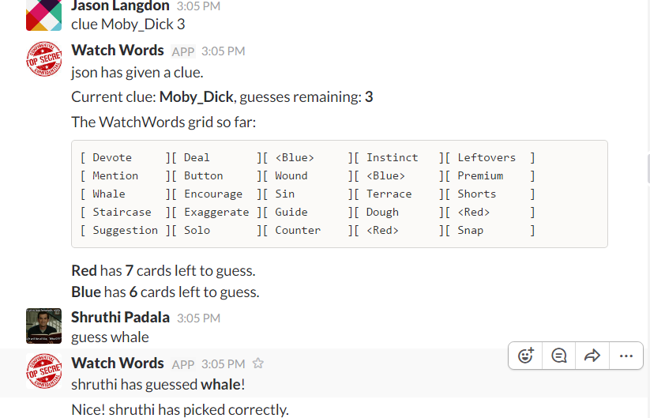

# WatchWordBot
A slack bot that plays the game WatchWords

## How to clone and open the project
1. git clone git@github.com:eraether/WatchWordBot.git
2. Open Eclipse -> File -> Import -> Gradle Project
  Root folder: The directory you cloned
3. Click Build Model

## How to run the project
`gradle runner`

Under Program Args add
`-PapiKey="\<YOUR SLACK API KEY GOES HERE\>"`
